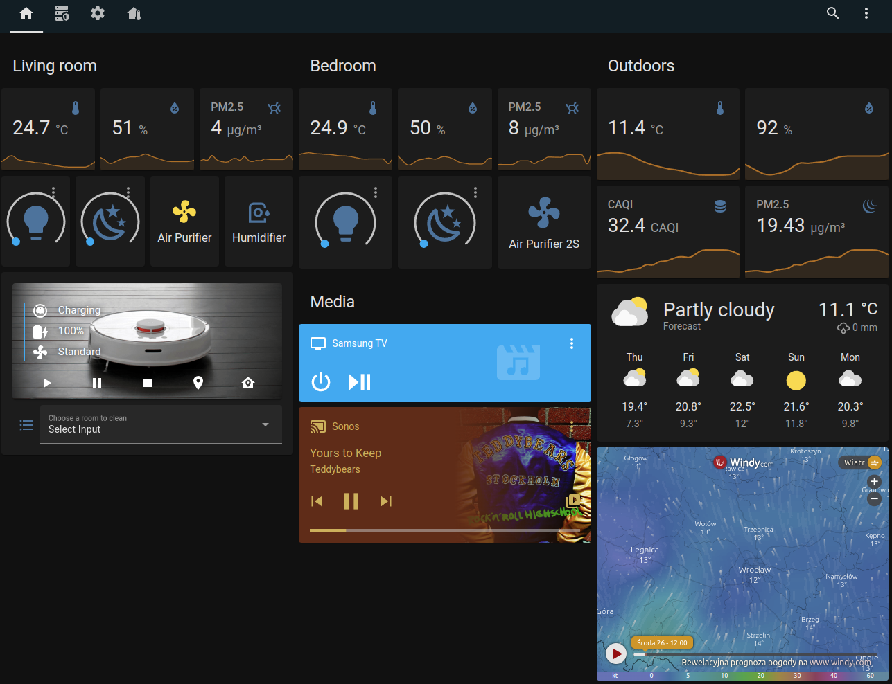
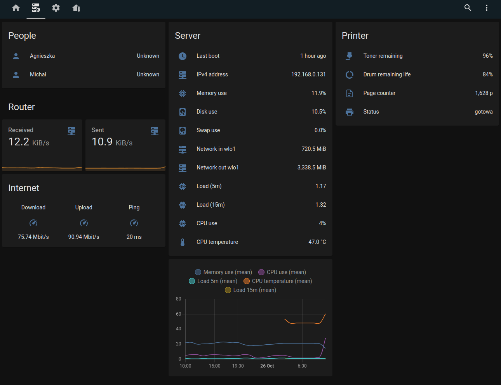
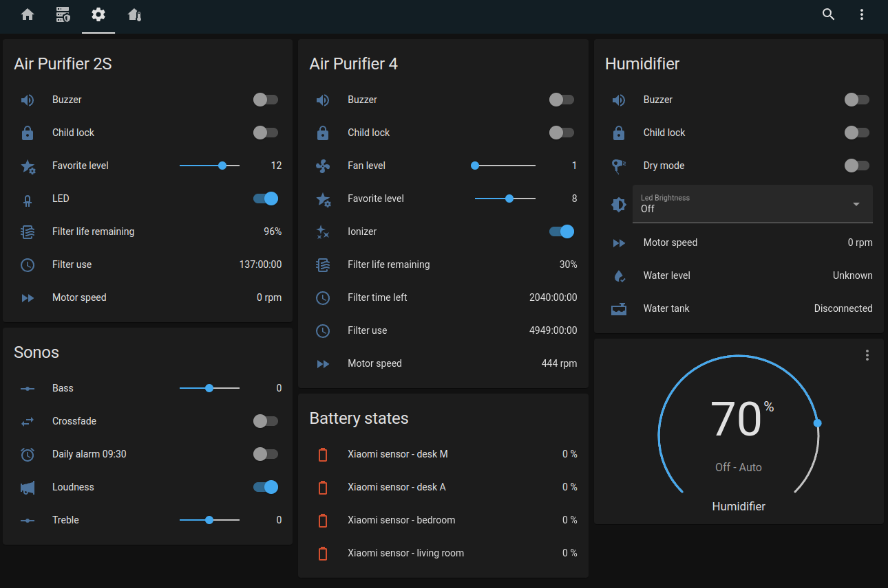

# Home Assistant Configuration

This is a first version of my smart home system based on the [Home Assistant](https://www.home-assistant.io/).

## Dashboard views

### Main dashboard

### Server and network

### Devices configuration/maintenance

## Software

### Integrations

| Application | Integration | Description |
|---|---|---|
| Windy.com | [iframe](https://www.home-assistant.io/dashboards/iframe/) | Weather map |
| Airly.com | [airly](https://www.home-assistant.io/integrations/airly/) | Outdoors air quality |
| Met.no | [Weather Forecast Card](https://www.home-assistant.io/dashboards/weather-forecast/) | Forecast (Meteorologisk institutt) |
| SpeedTest.com | [speedtestdotnet](https://www.home-assistant.io/integrations/speedtestdotnet/) | Monitoring of the internet speed |

### Custom cards - lovelace dashboard

- [Xiaomi Vacuum Card](https://github.com/benct/lovelace-xiaomi-vacuum-card)
- [Battery Entity](https://github.com/cbulock/lovelace-battery-entity)

## Hardware

### Lights

| Device | Connectivity | Integration | Description |
|---|---|---|---|
| Yeelight Ceiling Light (YLXD01YL) | WiFi/Bluetooth | [yeelight](https://www.home-assistant.io/integrations/yeelight/) | 32 cm, 1800 lm, 28W, 2700-6500K |
| Yeelight Ceiling Light (Jiaoyue 480, YLXD05YL) | WiFi/Bluetooth | [yeelight](https://www.home-assistant.io/integrations/yeelight/) | 48 cm, 2200 lm, 34W, 2700-6500K |

### Air Purifiers/Humidifiers

| Device | Connectivity | Integration | Description |
|---|---|---|---|
| Xiaomi Air Purifier 2S | WiFi | [xiaomi_miio](https://www.home-assistant.io/integrations/xiaomi_miio/) | <=288 m3/h, 21-37 m2, 31-66 dB, 1,5-31 W, HEPA |
| Xiaomi Air Purifier 4 | WiFi | [xiaomi_miio](https://www.home-assistant.io/integrations/xiaomi_miio/) | <=400 m3/h, <50m2, 32-63 dB, <30W, HEPA H13, Ionizer |
| Smartmi Evaporative Humidifier | WiFi | [xiaomi_miio](https://www.home-assistant.io/integrations/xiaomi_miio/) | 240 ml/h, 4l tank, 34-47 dB, <40m2, 8W  |

### Sensors

| Device | Connectivity | Integration | Description |
|---|---|---|---|
| Xiaomi Temperature & Humidity 2 | Bluetooth (BLE) | [Xiaomi BLE](https://www.home-assistant.io/integrations/xiaomi_ble/) | resolution: 0.1 oC 1% RH|

### Vacuum Cleaners

| Device | Connectivity | Integration | Description |
|---|---|---|---|
| Xiaomi Roborock S5 | WiFi | [xiaomi_miio](https://www.home-assistant.io/integrations/xiaomi_miio/) | Cleaning robot with lidar |

### Media

| Device | Connectivity | Integration | Description |
|---|---|---|---|
| Ikea Symfonisk Speaker (Sonos) | WiFi | [Sonos](https://www.home-assistant.io/integrations/sonos/) | Smart speaker |
| Samsung TV UE55NU7172 | WiFi | [samsungtv](https://www.home-assistant.io/integrations/samsungtv/) | Tizen based |

### Network

| Device | Connectivity | Integration | Description |
|---|---|---|---|
| TP-Link Archer C7 (AC1750) | Eth/WiFi | | Router, 1750 Mb/s a/b/g/n/ac, 2.4/5 GHz |

### Others

| Device | Connectivity | Integration | Description |
|---|---|---|---|
| C&H Veritas | WiFi | [gree](https://www.home-assistant.io/integrations/gree/) | Air conditioner, 3.5 kW power |
| Brother DCP-1610W | WiFi | [brother](https://www.home-assistant.io/integrations/brother/) | Laser printer |
| Linak desk | Bluetooth | [linak_desk](https://github.com/mdrwiega/linak_desk) | Electrical desk with adjustable height |